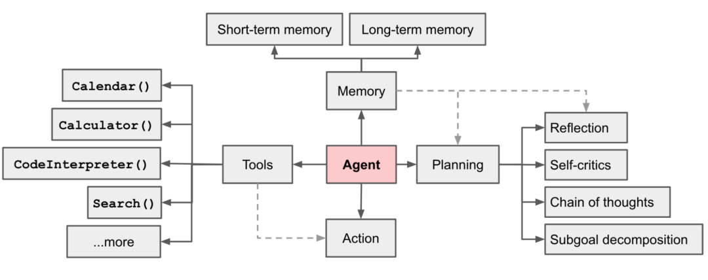

#### AI Agent
- agent认知与原理分析
  - agent是基于LLM的能够自主理解、自主规划决策、执行复杂任务的智能体
  - 设计目的: 为了处理那些简单的语言模型可能无法直接解决的问题, 尤其是当这些任务涉及到多个步骤或需要外部数据源的情况
- agent技术框架
- agent策略分析与parer解读
- 单agent与多agent
- 个性化agent应用全流程

####  Agents流程图

- 规划(Planning): 智能体会把大型任务分解为子任务, 并规划执行任务的流程; 智能体会对任务执行的过程进行思考和反思, 从而决定是继续执行任务或判断任务完结并终止运行
- 记忆(Memory)：智能体会记住执行过程中的上下文信息, 包括: 智能体执行过程中的指令, 以及执行过程中产生的结果等
  - 短期记忆: 是指在执行过程中的上下文, 会在子任务的执行过程中产生和暂存, 在任务完结后被清空
  - 长期记忆: 是指外部知识库, 通常用向量数据库来存储和检索
- 工具使用(Tools)：为智能体配备工具API, 比如计算器、搜索工具、代码执行器、数据库查询等. 有了这些工具API, 智能体就可以根据任务需求, 调用工具来获取需要的数据, 并根据数据执行任务
- 执行(Action)：根据规划和记忆来实施具体行动, 这可能会涉及到与外部世界或通过工具来完成任务。智能体根据规划的结果, 依次执行各个子任务, 并记录每个任务的执行结果, 并将结果反馈给规划器, 以便进行下一步的规划

#### Agents决策流程(一个循环一个Task)
- 感知(perception): 指Agent从环境中收集信息并从中提取相关知识的能力
- 规划(planning): Agent根据感知到的信息, 制定一个或多个任务的执行计划
- 执行(action): Agent按照执行计划, 依次执行每个任务, 并记录每个任务的执行结果
- 观察(observation): Agent观察自身行为, 并记录观察到的信息
